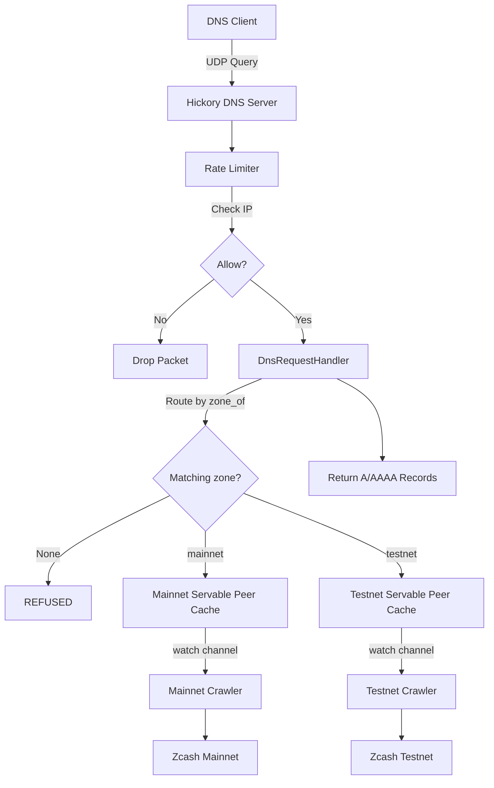
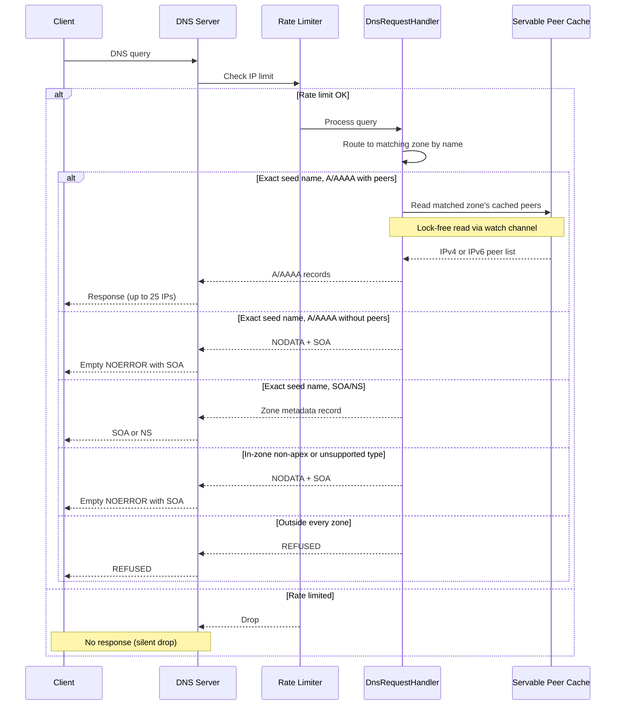
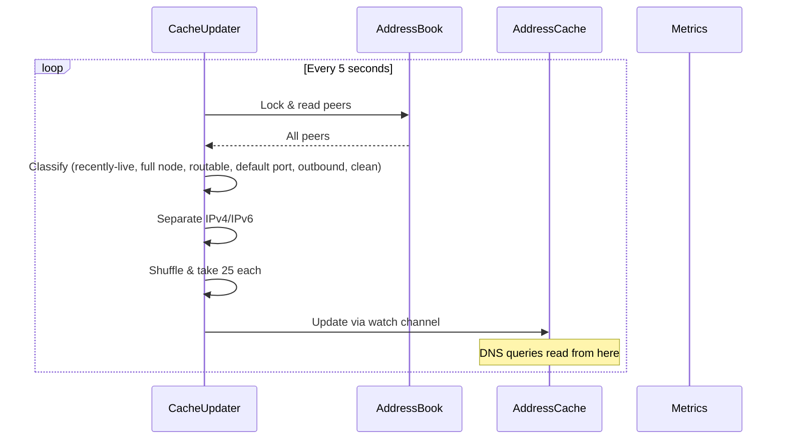
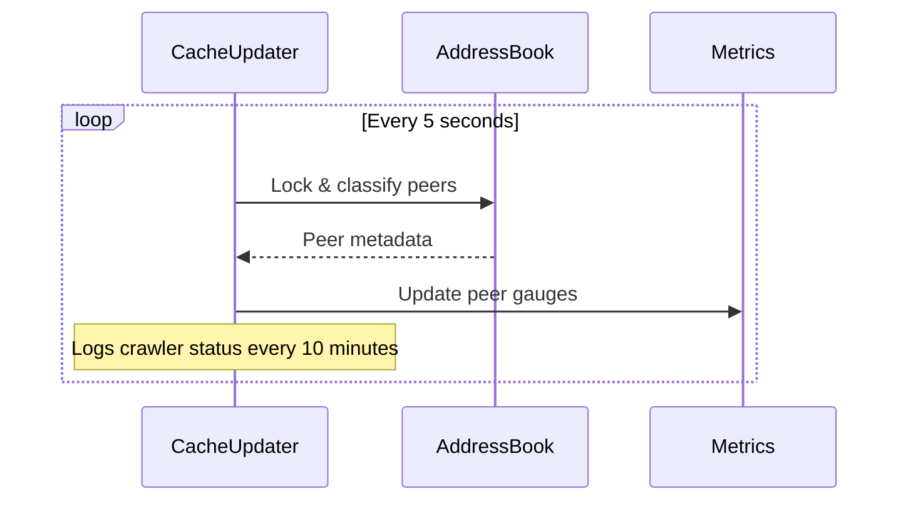

# Architecture

## Overview

zeeder is a DNS seeder for Zcash that crawls the network and serves DNS records pointing to healthy peers. One process serves a zone per network (mainnet, testnet), running an independent crawler for each and answering all of their zones on one DNS listener.

### Core Components

- **zebra-network**: Handles Zcash P2P networking and peer discovery
- **Hickory DNS**: DNS server framework via `hickory-server` and `hickory-proto`
- **Rate Limiter**: Per-IP rate limiting using governor crate
- **Servable Peer Cache**: Lock-free cache of servable peers, updated every 5 seconds
- **Address Book**: Thread-safe peer storage managed by zebra-network
- **Metrics**: Prometheus metrics via metrics-exporter-prometheus

## Data Flow

### Startup Sequence

1. Load configuration (defaults, optional TOML file, then environment overrides); fail if no zone is configured
2. Initialize metrics endpoint (if enabled)
3. Bind the shared DNS UDP and TCP sockets, failing before P2P startup if the configured address is unavailable
4. For each configured network: pin its chain-tip floor, initialize zebra-network with its address book, and spawn its address cache updater (every 5 seconds), building one seed zone bound to that network's servable-peer feed
5. Create the shared rate limiter (if enabled)
6. Start the health endpoint (if enabled), reporting per-zone readiness
7. Register the pre-bound sockets and start the DNS server with the routed zone set
8. Run until the DNS server exits, SIGINT is received, or SIGTERM is received

### DNS Query Handling

**Steps:**
1. Client sends DNS query
2. Rate limiter checks if IP is within limits
3. If rate-limited: packet dropped silently (no amplification)
4. If allowed: route the query to the zone whose domain contains the query name
5. For an exact zone-domain A/AAAA query, read that zone's cached addresses (lock-free via watch channel)
6. Return pre-filtered and shuffled peers, or NODATA plus SOA if that address family has no servable peers
7. Return static SOA/NS metadata for SOA/NS queries
8. Return NODATA plus SOA for unsupported exact-name queries or deeper in-zone labels
9. Return REFUSED for names outside every configured zone

### Address Cache Updates

**How it works:**
- Background task updates cache every 5 seconds
- Cache contains pre-filtered, pre-shuffled IPv4 and IPv6 lists
- DNS queries read from cache without locking (via tokio `watch` channel)
- Eliminates lock contention during high query load

### Crawler Status and Metrics

**How it works:**
- zebra-network continuously discovers and manages peers
- The address cache updater publishes peer count gauges from the same classification pass that refreshes DNS answers
- The updater logs crawler status every 10 minutes without taking an extra address-book lock

## Components Deep Dive

### zebra-network Integration

**What:** Zcash P2P networking library from the Zebra project

**Responsibilities:**
- Peer discovery via DNS seeds and peer exchange
- Connection management
- Protocol message handling
- Address book maintenance

**Our usage:**
- Initialize one independent crawler per configured network, each with a dummy inbound service (reject all)
- Pass each crawler a `SeederChainTip` pinned to that network's current upgrade, so the handshake rejects outdated-version peers
- Read each network's Address Book for its servable peers
- Hold one peer-set handle per network for the process lifetime (dropping it stops that network's crawl)
- Never send blockchain data (we're not a full node)

---

### Hickory DNS Server

**What:** Async DNS server framework (formerly trust-dns)

**Responsibilities:**
- DNS protocol handling (UDP/TCP)
- Query parsing
- Response building

**Our usage:**
- Implement `RequestHandler` trait via a single `DnsRequestHandler` that owns every zone
- Route each query to the zone whose domain contains the query name, reading that zone's servable-peer feed
- Handle A, AAAA, SOA, and NS queries at each zone's exact seed name
- Return NODATA plus SOA for empty A/AAAA families, unsupported exact-name queries, and deeper in-zone labels
- Return REFUSED for names outside every zone

---

### Rate Limiter

**What:** Per-IP rate limiting to prevent DDoS amplification

**Implementation:**
- `governor` crate with token bucket algorithm
- `DashMap` for concurrent IP tracking
- Each IP gets isolated rate limiter instance

**Configuration:**
- Default: 10 queries/second per IP
- Burst: 20 queries (2x rate)
- Configurable via `rate_limit` config section

**Behavior:**
- Rate-limited requests: dropped silently (no response)
- Metric: `zeeder_dns_rate_limited_total`

---

### Address Cache

**What:** Lock-free cache providing pre-filtered peer addresses for DNS responses

**Problem Solved:**
- Original design locked the address book mutex on every DNS query
- Under high query load, this caused lock contention
- Queries backed up waiting for the mutex

**Solution:**
- Background task updates cache every 5 seconds
- Uses `tokio::sync::watch` channel for lock-free reads
- DNS queries read from cache without any locking

**Behavior:**
- Cache refresh takes one address-book lock every 5 seconds.
- Each refresh classifies peers, separates IPv4 and IPv6 addresses, shuffles each family, and caps each answer set at 25.
- DNS handlers read the current snapshot through a watch channel without taking the address-book lock.

**Trade-offs:**
- ✅ Zero lock contention during DNS queries
- ✅ Predictable low-latency responses
- ⚠️ Peer list may be up to 5 seconds stale (acceptable for DNS seeding)

---

### Address Book & Mutex Handling

**Mutex Strategy:**
- Each network's Address Book is protected by its own `std::sync::Mutex`
- Only locked by that network's cache updater (every 5 seconds)
- DNS queries never lock the mutex directly

**Poisoning Recovery:**
- If thread panics while holding lock, mutex becomes "poisoned"
- We recover by calling `poisoned.into_inner()`
- Log error + increment metric
- Continue serving (availability over strict correctness)

**Peer Servability (done in cache updater, see `crawl::servability`):**

A peer is *servable* only if it is:
- Recently live: zebra-network handshaked it within the liveness window (transitively current-version and reachable)
- A full node: advertises the `NODE_NETWORK` service (zebra's handshake enforces the version floor but not services, so the seeder gates on it)
- Routable (no loopback, unspecified, multicast)
- On the network default port (usually 8233)
- Not recorded from an inbound connection
- Clean: no zebra-network misbehavior score

The inbound and misbehavior gates mirror zebra-network's own `MetaAddr::sanitize` behavior for GetAddr replies. A peer that reaches the ban threshold is removed from the address book in the same update that bans it, so it never reaches this filter; a peer with a sub-ban misbehavior score remains in the address book but is not served over DNS.

Servable peers are then separated by address family (IPv4/IPv6), shuffled, and capped at 25.

---

### Configuration System

**Override priority:**
1. Environment variables (`ZEEDER__*`)
2. TOML config file
3. Hardcoded defaults

**Implementation:**
- `config` crate for loading
- `serde` for deserialization
- Optional `.env` loading via `dotenvy`; a present malformed `.env` fails startup
- Validation runs on the resolved config before `print-config` or DNS startup proceeds

---

### Metrics

Prometheus metrics are exposed on the configured metrics endpoint. Architecture-level metrics are grouped around peer servability, DNS traffic, rate limiting, mutex poisoning, protocol-version floor, and build identity. Per-network metrics carry a `network` label. The canonical metric reference, labels, and alert guidance live in [Operations](operations.md#metrics).

---

### Health Endpoint

**What:** A minimal HTTP endpoint for orchestrator liveness and readiness probes, served only when `health.endpoint_addr` is configured.

**Behavior:**
- `GET /health` returns `200` while the process runs (liveness).
- `GET /ready` returns `200` only when every zone has at least `health.ready_threshold` servable peers, otherwise `503` with a per-zone breakdown (readiness).

It reads each zone's servable-peer feed directly, so readiness reflects live crawl state. The contract is a plain status code, so it is a small hand-rolled HTTP/1.1 responder rather than a web framework.

## Architecture Decision Records

- [ADR 0001: Use zebra-network for Peer Discovery](adr/0001-zebra-network.md)
- [ADR 0002: Use Hickory DNS for DNS Server](adr/0002-hickory-dns.md)
- [ADR 0003: Implement Per-IP Rate Limiting](adr/0003-rate-limiting.md)
- [ADR 0004: Peer Servability and Protocol-Version Floor](adr/0004-peer-servability.md)
- [ADR 0005: Multi-Network Serving Topology](adr/0005-multi-network-topology.md)
- [ADR 0006: Image Identity and Fleet Delivery](adr/0006-image-identity-and-fleet-delivery.md)

## Design Principles

1. **Security First**: Rate limiting and domain validation prevent abuse
2. **Availability**: Mutex poisoning recovery ensures continued operation
3. **Performance**: Concurrent data structures, early limiting, minimal allocations
4. **Observability**: Comprehensive metrics for monitoring
5. **Simplicity**: Leverage proven libraries (zebra-network, Hickory DNS)
6. **Configurability**: All key parameters are configurable
